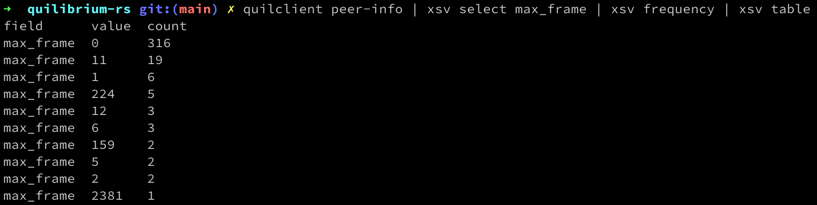

# Quilibrium Rust Client Library & CLI

## CLI



Please see the CLI readme for install and usage instructions: [crates/quilclient/README.md](crates/quilclient/README.md)

## Client Library

```rust, no_compile
// Import the client
use quilibrium::NodeClient;

// Connect to your node
let mut client = NodeClient::new("http://1.2.3.4:5678".parse()?).await?;
// Fetch the peers from the node's peer store
let network_info = client.network_info().await?;
```

Please see the client library readme for install and usage instructions: [crates/quilibrium/README.md](crates/quilibrium/README.md)

## Related Projects

- [Quilbrium Ceremony Client](https://github.com/QuilibriumNetwork/ceremonyclient)
- [Quilibrium Metrics for Prometheus](https://github.com/sirouk/quilibrium-node-exporter)
