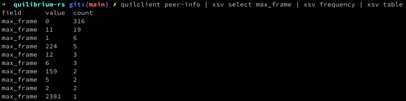

# Quilibrium Client CLI

## Installation

1. Install the Rust toolchain manager if you don't have it installed already: https://rustup.rs/
2. Install the Quilibrium CLI: `cargo install quilclient`

## Example usage

Fetch the peers from the node's peer store and print them to stdout as CSV:

```bash
quilclient network-info --node-uri http://1.2.3.4:5678 
```

The node URI is the gRPC URI of the Quilibrium node. See the [Ceremony Client
readme](https://github.com/quilibriumnetwork/ceremonyclient#experimental--grpcrest-support)
for more on the node URI.

Alternatively provide the node URI as an environment variable:

```bash
export QUILCLIENT_NODE_URI=http://1.2.3.4:5678
quilclient network-info
```

Output:

```csv
peer_id,multiaddr,peer_score
QmT9ihPGK3U2MPFXyiy9Djhoiv9V2F3uPx2aq5PwTxepMP,/ip4/71.212.120.219/udp/8336/quic,0.0
QmcYNKu7FBUfjUvNRbj2shHXX18KC4t3PEypzkcGXu21RT,/ip4/51.81.48.32/udp/26946/quic,0.0
QmcYNKu7FBUfjUvNRbj2shHXX18KC4t3PEypzkcGXu21RT,/ip4/51.81.48.32/udp/54697/quic,0.0
...
```

You can save the output to disk and open it with a spreadsheet program or you can pipe the output to a command line CSV viewer such as [xsv:](https://github.com/BurntSushi/xsv)



## Docs

```
Quilibrium CLI client

Usage: quilclient [OPTIONS] <COMMAND>

Commands:
  download-frame  Download a frame as a protobuffer and save it to disk
  frames          Fetch frame metadata from the node and print it to stdout as CSV
  network-info    Fetch the peers from the node's peer store and print them to stdout as CSV
  peer-info       Fetch the broadcasted sync info that gets replicated through the network mesh and print it to stdout as CSV
  token-balance   Fetch the token balance of the node and print it to stdout in QUIL units as an integer
  token-supply    Fetch the confirmed token supply and print it to stdout in QUIL units as an integer
  help            Print this message or the help of the given subcommand(s)

Options:
  -u, --node-uri <NODE_URI>  The gRPC URI of the Quilibrium node, e.g. <http://1.2.3.4:5678>. See the Ceremony Client readme for more: <https://github.com/quilibriumnetwork/ceremonyclient#experimental--grpcrest-support> [env: QUILCLIENT_NODE_URI=]
  -h, --help                 Print help
  -V, --version              Print version
```


## Troubleshooting

Make sure `$HOME/.cargo/bin` is on your path.

## [Changelog](./CHANGELOG.md)
